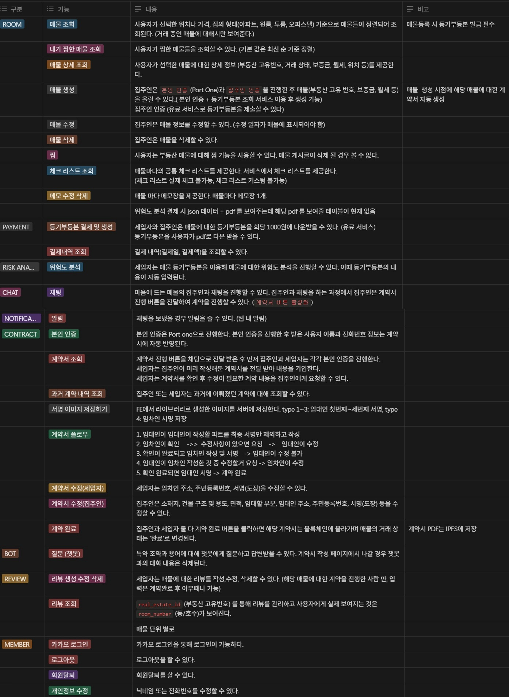
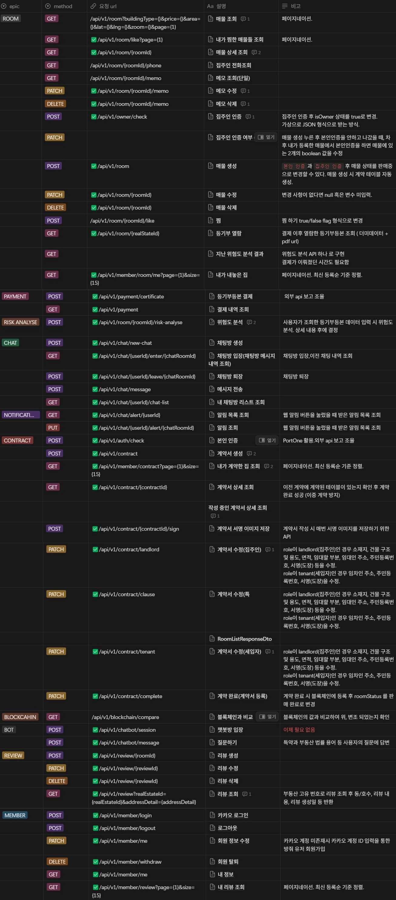
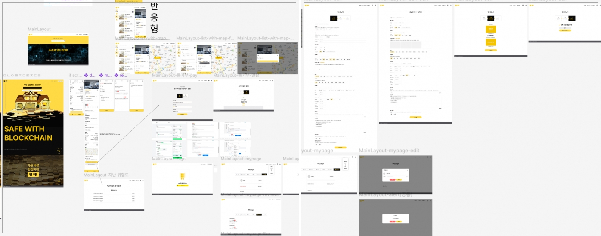
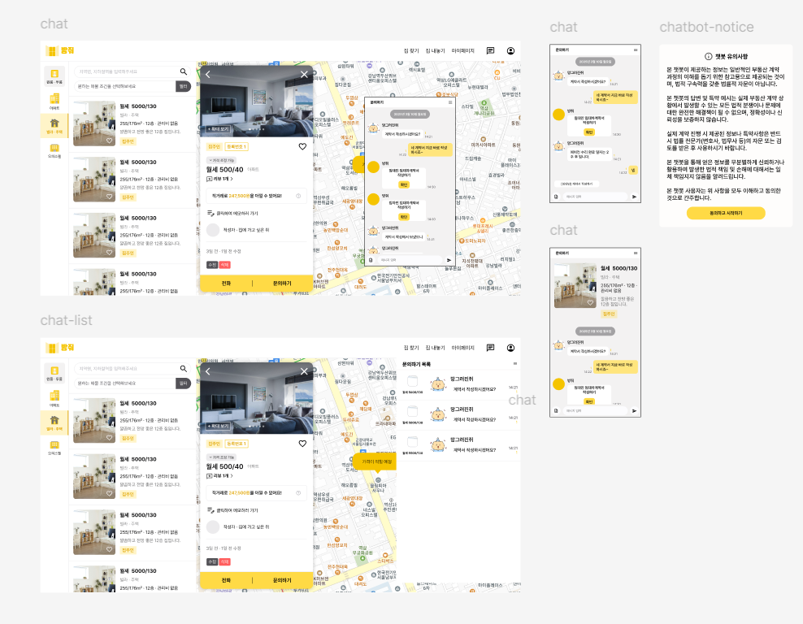
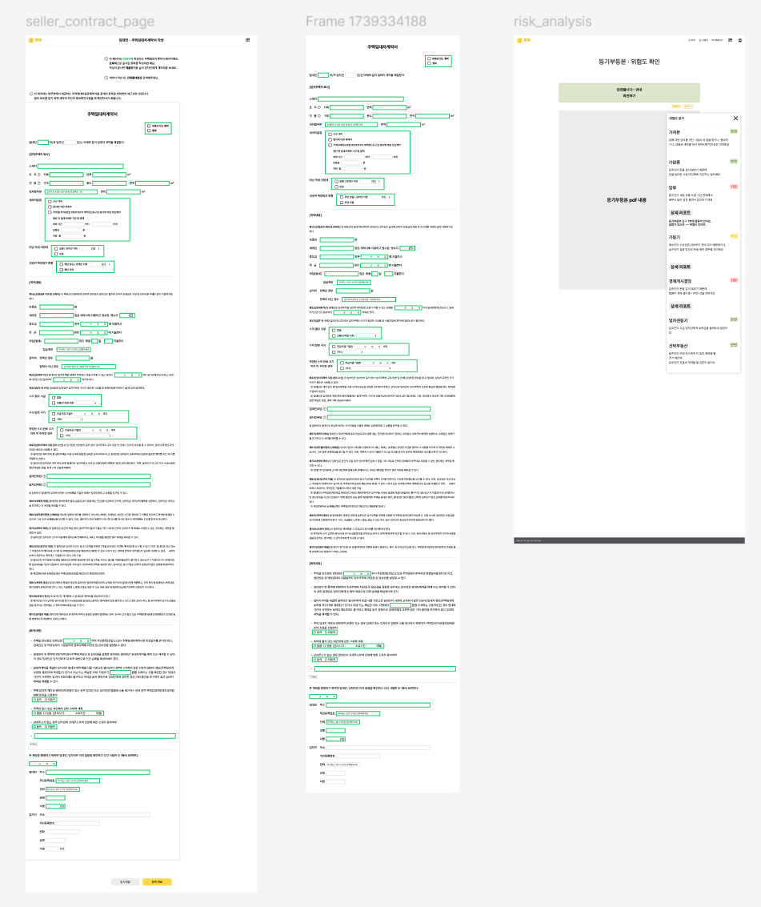
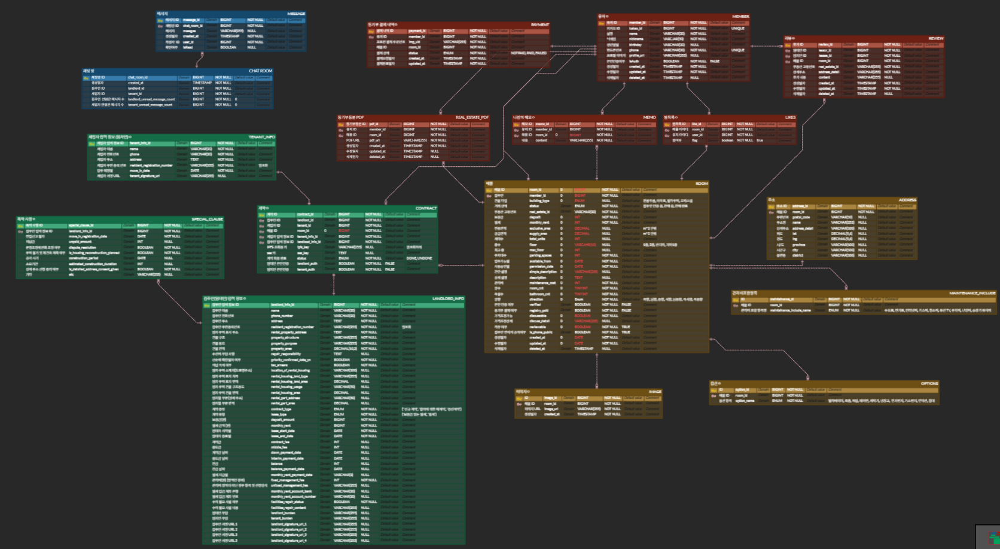
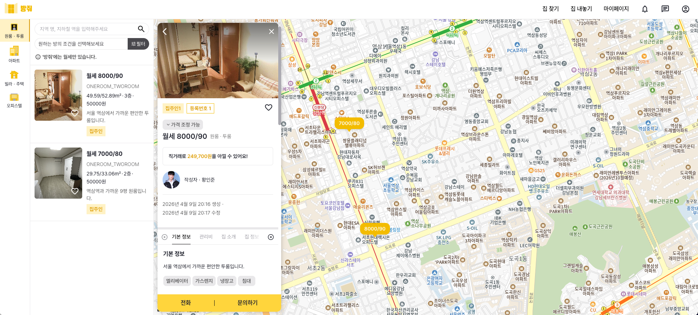
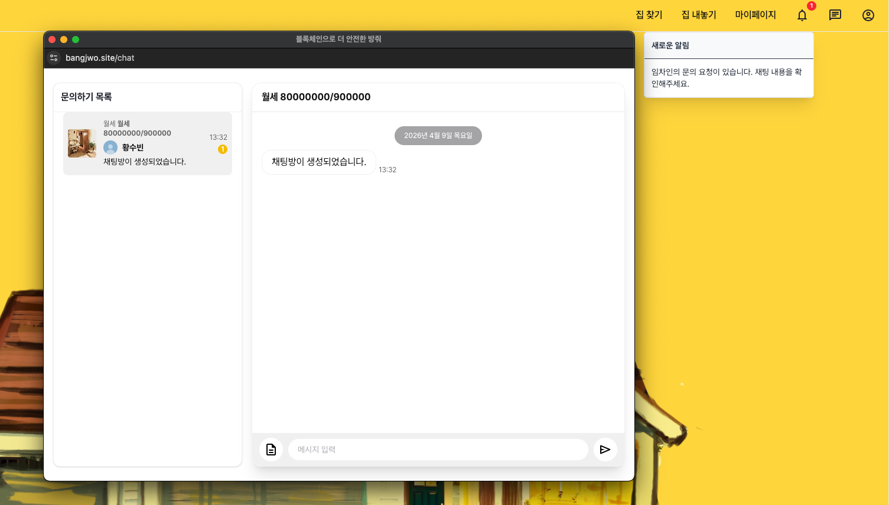
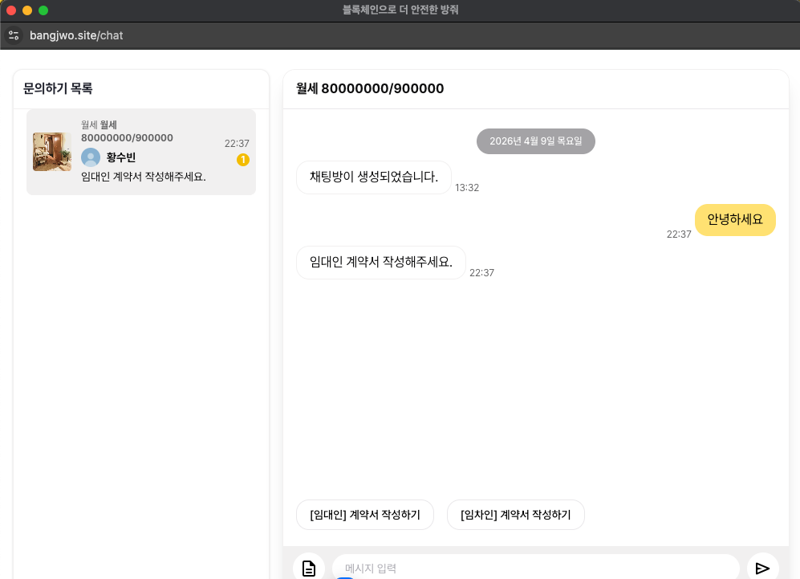
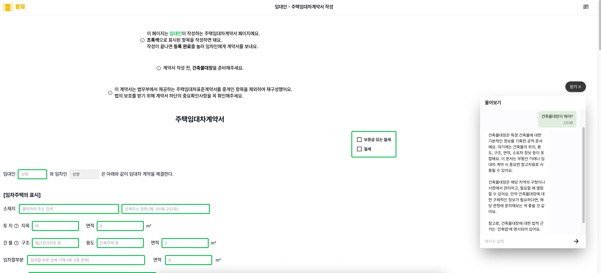

 
# 🏠 방줘 : 중개사 없이 싸고 안전하게  
> 블록체인 기반 원스톱 부동산 거래 플랫폼  

---

## 📌 프로젝트 소개

**"방줘"**는 부동산 중개 수수료와 사기 위험을 줄이기 위해  
**AI와 블록체인을 결합**하여 만든 부동산 거래 플랫폼입니다.

- 맞춤형 매물 탐색부터 계약 체결까지 한 번에!
- 계약서 작성이 어려울 땐 AI 챗봇이 도와드립니다.
- 계약은 블록체인에 기록되어 위변조 걱정 없이 투명하게!

- BE 4명, FE 2명으로 구성되어 진행하였으며 저는 로그인 및 회원 기능, 매물 기능 및 계약 기능을 담당하였습니다.
- 개인적으로 프로젝트를 추가 진행하여 마무리 지었고, AWS Lightsail, Vercel을 활용하여 배포, 호스팅 하였습니다.

### - [방줘 사이트 링크](https://bangjwo.site)

<br>

## 시스템 아키텍처


---

## ⚙️ 기술 스택

✅ Backend (Main - Spring)

- Java, Spring Boot: 메인 비즈니스 로직 및 REST API 서버 구축
- Spring Data JPA: RDBMS 데이터베이스 ORM 제어
- OAuth2: 카카오 소셜 로그인 및 JWT 기반 인가/인증
- Webflux: 비동기 논블로킹 통신
- SSE: 또는 SSE 실시간 통신
- Swagger : 프론트엔드와의 협업을 위한 API 명세서 자동화

<br>

✅ Backend (AI - Python)
- Python, FastAPI: 가볍고 빠른 AI 전용 마이크로서비스(API) 구축
- LangChain, OpenAI API: GPT-4o-mini 모델을 활용한 RAG(검색 증강 생성) 챗봇 파이프라인 구축

<br>

✅ Frontend
- React, Vite: 사용자 UI 구축 및 프론트엔드 빌드 환경 구성
- Vercel: 프론트엔드 무중단 호스팅 및 자동 배포

<br>

✅ Database
- MySQL (8.0): 회원, 매물, 계약 등 핵심 관계형 데이터 영구 저장
- MongoDB (7.0): 채팅 내역, 리뷰 등 스키마가 유연한 비정형 데이터 저장
- Redis (7.0): Refresh Token 관리 및 빠른 데이터 캐싱
- ChromaDB: 부동산 법령 및 특약사항 검색 (AI RAG 용도)

<br>

✅ BlockChain / Web3
- Solidity: 이더리움/폴리곤 네트워크 기반의 부동산 스마트 컨트랙트 작성
- INFURA: 직접 노드를 구축하지 않고 블록체인 네트워크와 통신하기 위한 노드 프로바이더
- PINATA: 계약서 원본 파일의 무결성을 보장하기 위한 IPFS(분산 파일 시스템) 업로드

<br>

✅ Infra & DevOps
- AWS Lightsail: 가성비 높은 단일 가상 서버(VPS) 호스팅
- AWS S3: 매물 사진, 프로필, 계약 사인 등 무거운 일반 이미지 파일 스토리지
- Docker, Docker Compose: Nginx, Spring, Python, DB 등 모든 환경을 컨테이너화하여 일관성 유지
- GitHub Actions: 메인 브랜치 푸시 시 자동 빌드 및 Docker Hub를 거친 CI/CD 파이프라인 구축
- Nginx: 리버스 프록시, SSL 인증 처리 및 포트 라우팅

<br>

✅ Logging & Monitoring
- ELK Stack (Elasticsearch, Logstash, Kibana): 분산된 서버(Spring, Nginx)의 로그를 중앙 집중화하여 수집하고 시각화 대시보드 구축

<br>

✅ External APIs
- Kakao Maps API: 부동산 매물 위치 지도 시각화
- PortOne: 사용자 본인인증 및 매물 등록 수수료 결제 처리

<br><br>

---

## 요구사항 명세서

<p align="center">
  
</p>


## API 명세서

<p align="center">
  
  
</p>

## ✨ 주요 기능

1. **맞춤형 부동산 매물 탐색**  
   - 사용자의 조건 기반 필터링 (위치, 가격, 구조 등)
   - 즉시 확인 가능한 매물 카드 뷰 제공

2. **AI 기반 스마트 계약서 지원**  
   - 계약서 항목 실시간 설명
   - 법률 용어 및 특약 조건 이해 보조

3. **블록체인 기반 계약서 관리**  
   - IPFS 및 블록체인 기록으로 위변조 방지
   - 투명하고 신뢰성 있는 거래 제공

4. **등기부 기반 사기 예방 시스템**  
   - 등기부등본 자동 판독 및 위험도 분석
   - 사기 위험 매물 사전 경고 제공

5. **계약서 작성 보조 시스템**  
   - 챗봇 연동을 통한 용어/조항 실시간 설명
   - 사용자 중심의 직관적 계약서 작성 환경

<br>

## 담당한 기능

📑 회원 기능
- 카카오 소셜 로그인 및 Redis RTR 기반 보안 인증 구현
- 회원가입, 회원 정보 수정 및 마이페이지(매물/계약/결제 내역) 통합 조회
- 마이페이지 조회 (매물/계약/결제 내역 등)
- 포트원(PortOne) API를 활용한 사용자 실명 및 본인인증

📑 매물 기능
- 매물 등록/ 필터링 조회
- 카카오 장소 API 매물 주소 조회

📑 계약 기능
- 계약서 생성/수정/조회 및 Redis 분산 락을 활용한 동시성 제어
- 계약서 IPFS 저장 및 조회

📑 인프라 설계 및 자동 배포
- GitHub Actions와 Docker Hub를 연동한 CI/CD 자동화 파이프라인 구축
- AWS Lightsail(BE)과 Vercel(FE)을 활용한 프로덕션 환경 구축 및 Nginx 리버스 프록시 라우팅 적용
- 가성비 서버의 한계를 극복하기 위해 Swap Memory(4GB) 할당
- 분산 서버(Spring, Python) 환경을 위한 ELK Stack 기반 중앙 집중형 로깅 아키텍처 설계

<br>

## Figma

<p align="center">
  
  
  
</p>

---

## ERD

<p align="center">
  
</p>

---

## 서버 트러블 슈팅

### 1. 공통 모듈 분리

**이슈 발생 환경**

- 팀원마다 도메인을 구현하는데 있어 일관되고 명확한 예외 메시지를 반환하여야 했습니다.
- `JPA`를 사용하여 `Page` 컬렉션을 반환하는데 일관된 페이지 필터링 조건과 기본값 설정이 필요했습니다.
- 유저 프로필 이미지, 매물 이미지, 계약 서명, 등기부등본 PDF 등 다양한 도메인에서 `AWS S3`에 파일을 저장하거나 조회가 필요하여 중복된 코드가 발생하였습니다.
- API 마다 로그인 정보가 필요한 API가 있고 필요없는 API가 존재하고, 추가적으로 찜 매물 여부 같은 로그인 정보가 있다면 추가적인 로직이 필요한 API들이 존재했습니다.

**이슈 해결 고민 및 해결 방법**

- 일관된 상태코드, 서버 예외 코드, 예외 메시지 등을 보유한 객체가 필요하고, 도메인마다 관리를 할 수 있도록 도메인 별 예외 객체를 관리하도록 설계가 필요하였습니다. 이에 있어 상태코드, 서버 예외 코드, 예외 메시지 등을 조회하는 인터페이스를 도메인 마다 상속한 `ENUM` 예외 구현체를 생성하였습니다. 또한 해당 인터페이스를 파라미터로 가지는 커스텀 예외 클래스를 생성하여 전역으로 예외를 관리하였습니다.
- `JPA` 에서는 `Page`객체를 지원하여 엔티티들을 받아올 수 있는데, `Pageable`객체를 파라미터로 사용하여 특정 개수의 페이지 조회가 가능했습니다. 이에 Util 클래스를 구현하여 기본값을 지정한 `Page` 객체를 반환하였습니다.
- 하나의 도메인에서 매번 `AWS S3` 정보를 관리하고 있는 구조가 잘못된 설계로 판단되어 관련 데이터를 관리하는 어댑터 클래스를 구현하였습니다. 이후 각 도메인 서비스 계층에서 어댑터 클래스를 의존성 주입하여 다른 도메인에서 쉽게 파일을 업로드하도록 변경하였습니다.
- 우선 로그인 정보가 필요한 API에 있어 표현 계층에서 커스텀 어노테이션을 추가하고, `ArgumentResolver`에서 `JWT`를 파싱하고 유저 ID를 반환하도록 구현했습니다. 하지만 아직 찜 매물 조회 같은 로그인 정보가 있다면 추가적으로 로직이 필요한 경우가 존재했고, 이를 해결하기 위해 커스텀 어노테이션 내부에 `Boolean`값의 변수 관리를 통해 기본값이 아니라면 `null`인 유저 ID를 반환하도록 하였습니다.

**개선된 사항**

- 도메인 마다 예외 메시지를 관리하기 용이해졌고, 클라이언트는 일관된 형식의 예외 메시지를 반환받을 수 있었습니다.
- 간단하게 `Page` 객체를 반환할 수 있었고, `JPA` 내부적으로 필요한 개수의 엔티티만을 조회하여 성능이 개선되었습니다.
- `AWS S3` 정보를 도메인마다 관리하지 않고 특정 어댑터 클래스가 관리하여 의존성 주입을 통해 사용이 용이해지고, 중복 코드가 감소하는 등 더 객체 지향적인 코드를 구현할 수 있었습니다.
- 로그인 정보가 필요한 API를 개발자들이 한눈에 보기 용이해졌고, 로그인 정보를 파싱하는 작업을 전처리하여 간단하게 유저 ID를 반환받을 수 있었습니다.

<br>

### 2. 단방향 연관관계 N+1 문제 해결

**이슈 발생 환경**

- 엔티티간 연관 관계에 있어 매물을 바라보는 여러 엔티티들이 존재하여, 여러 엔티티 내부에 매물 정보가 있는 단방향 구조로 구성하였습니다.
- 단방향으로 적용한 이유는 다른 사람들이 연관 관계를 이해하기 쉽고, 순환 참조를 방지하기 위해 단방향으로 구성하였는데 이후 매물 페이지 정보들을 조회하고 이후 매물과 연관된 객체를 가져오는데 있어 조회한 `Page`의 개수 만큼 N + 1 문제가 발생하였습니다.

**이슈 해결 고민 및 해결**

- 이를 해결하는 방법으로는 매물 엔티티에서 양방향 연관관계를 추가하고 `JPQL` 코드를 통해 필요한 API 에서 쿼리 한번에 엔티티들을 가져오는 방법과 네이티브 쿼리, `IN` 절을 사용한 배치 처리 등이 존재했습니다.
- 우선 `Spring Data JPA` 공식 문서에 따르면, 페치 조인 + 페이징은 권장하지 않으며, 양방향 구조를 가져가는 것은 팀원간 연관 엔티티 이해 및 사용에 있어 어려울 것이라고 생각하였습니다.
- 네이티브 쿼리의 경우는 반환값이 엔티티가 아니라면 영속성 컨테이너에서 관리를 하지 못하여 객체지향 코드 구현 및 영속성 컨테이너 관리가 어려워질 것 같다고 생각하여, `IN` 절을 사용한 배치 처리를 적용하였습니다.
- 우선 페이지만큼의 엔티티를 조회하고, 조회한 엔티티들과 연관된 엔티티의 ID들을 `Map`으로 보관하였습니다. 해당 `Map`에 조회하고자 하는 엔티티의 ID들을 `IN`절으로 한번에 조회했습니다.

```java
// SQL 3번 조회됨을 확인
Hibernate: 
    /* <criteria> */ select
        r1_0.room_id,
        r1_0.available_from,
        ...
    from
        room r1_0 
    where
        r1_0.monthly_rent<=? 
        and (
            r1_0.exclusive_area between ? and ? 
            or r1_0.exclusive_area between ? and ? 
            or r1_0.exclusive_area between ? and ?
        ) 
        and r1_0.room_id in ((select
            a1_0.room_id 
        from
            address a1_0 
        where
            a1_0.lat between ? and ? 
            and a1_0.lng between ? and ?)) 
    limit
        ?, ?
Hibernate:
         select
            l1_0.like_id,
            l1_0.member_id,
            l1_0.room_id
            ...
        from
            likes l1_0 
        where
            l1_0.room_id in (?, ?, ?) 
            and l1_0.member_id=?
Hibernate: 
        select
            i1_0.image_id,
            i1_0.image_url,
            i1_0.room_id,
            ...
        from
            image i1_0 
        where
            i1_0.room_id in (?, ?, ?) 
            and i1_0.created_at=(
                select
                    max(i2_0.created_at) 
                from
                    image i2_0 
                where
                    i2_0.room_id=i1_0.room_id
            )
```

**개선된 사항**

- 이를 통해 발생하는 `Hibernate` 조회 수가 해당 횟수만큼 감소된 것을 확인하였습니다. 결과적으로 등록된 매물 조회 리스트가 1 + 2N 번 조회에서 3번 조회되도록 개선되었습니다

<br>

### 3. 계약서 작성 동시성 문제 해결

**이슈 발생 환경**

- 계약서 작성 순서는 다음과 같습니다.
    1. 계약서 생성
    2. 임대인 계약서 저장
    3. 임차인 계약서 저장
    4. 작성된 계약서를 각자 최종 조회 후 수정
    5. 임차인 서명
    6. 임대인 서명
    7. 계약 최종 완료
- 해당 과정에 있어 임차인 서명하는 동안 임대인이 계약서를 수정하고 있는 경우가 존재하고, 임차인이 서명 완료하는 시점에 봤었던 계약서 내용과 달라질 수 있는 문제가 발생하였습니다.

**이슈 해결 고민 및 해결**

- 이를 해결하기 위해 한 스레드가 임대인 계약서를 수정하고 있거나, 임차인이 서명하고 있는 경우 접근하지 못하는 수단이 필요했습니다.
- 이를 해결하기 위해 락을 사용하여 접근을 막는 방법이 필요했는데 방법으로는 JVM 내부 락(`synchronized`, `ReentrantLock`), 스핀락 구현, `Redission`분산락, DB 낙관적/비관적 락 등이 존재했습니다.
- 결과적으로 Redis를 사용한 단순 락으로 문제를 해결하려고 하였는데, 그렇게 생각한 이유는 다음과 같습니다.
    - 스레드의 비정상적인 종료에 대비하여 자동으로 락을 해제하는 방법이 필요했고, 이는 JVM 내부 락은 한계 존재
    - Heartbeat Cheking의 스핀락의 경우 불필요한 CPU 점유 발생
    - 물리 DB를 직접 조회하고 상태를 확인하고 락을 거는 과정이 불필요한 물리 I/O 연산이나 병목을 추가한다고 판단
    - `Redission` 은 TTL 자동 연장 같은 여러 기능이 존재하지만 현재 락 요구 수준에서는 계약 관련 2명만이 하나의 계약서에 접근하고 있어 라이브러리 도입이 과도하다고 판단
    - 현재 프로젝트는 모놀리식 구조로 분산 환경을 고려할 필요는 없지만, 이후 `MSA`구조로 확장이 용이
    - 해당 이슈가 발생한 시점에서 이미 채팅 관련으로 Redis를 사용하고 있음
    - 이를 통해 싱글 스레드 기반인 `Redis`의 TTL을 통해 락 자동 해제를 목표
- 이를 통해 기존 서비스에서 호출해서 사용하기 용이하도록 서비스 계층에서 퍼사드 패턴을 적용하여 `Redis Lock`을 사용하도록 하였습니다.
    - `@RedisLock(key = "'contract:' + #requestDto.contractId", errorCode = RedisLockErrorCode.*LANDLORD_IN_PROGRESS*)` 와 같이 커스텀 어노테이션으로 서비스 메서드에 접근하였습니다.
- 해당 서비스는 락을 소유자만 해제할 수 있도록 `Lua` 스크립트를 사용하고 `setIfAbsent()` 메서드를 사용해 `Redis` 내부적으로 `SENTX`를 활용하여 락을 소유한 단일 스레드만 접근이 가능하도록 하였습니다.
- 추가적으로 `CountDownLatch`를 사용한 단위 테스트 코드를 작성하여 동시성 문제 해결을 확인하였습니다.


**개선된 사항**

- 기존 로직을 변경하지 않고, 커스텀 어노테이션을 통해 원하는 도메인, 특정 서비스에 `Redis Lock`을 쉽게 적용할 수 있게 되었습니다.
- 테스트 코드를 통해 해당 로직이 다른 팀원에게 동시성 문제를 해결하였음을 보장할 수 있었습니다.

<br>

### 4-4. Web3 기반 계약서 무결성 보장 및 저장 비용 최적화

### 문제 상황
- 부동산 계약서의 특성상 위변조가 절대 불가능해야 함
- 그러나 모든 계약 데이터를 블록체인 메인넷에 직접 저장(On-chain)할 경우 가스비(수수료)가 과도하게 발생하고 대용량 문서 처리가 어려움

### 해결 방안
- IPFS(Pinata)와 블록체인(Polygon)을 결합한 하이브리드 저장 방식 도입
- 계약이 성사되면 계약서 원본 파일(JSON/PDF)을 Pinata를 통해 분산 파일 시스템인 IPFS에 업로드하고, 파일 내용 기반의 암호화된 고유 해시값인 **CID(Content ID)**를 발급받음.
- 용량이 큰 원본 데이터는 오프체인 분산저장소(IPFS)에 보관하고, 데이터의 위변조 여부를 증명할 수 있는 'CID 값'만을 폴리곤 스마트 컨트랙트에 기록(On-chain)하도록 분리 설계

### 결과
- 온체인 트랜잭션 데이터 크기를 최소화하여 블록체인 저장 비용(가스비)을 90% 이상 획기적으로 절감
- 블록체인 탐색기(Polygonscan)를 통해 누구나 계약의 CID를 대조하여 위변조 여부를 검증(Trustless)할 수 있는 안전한 신뢰 기반 계약 시스템 구축

<br>

### 4-5. 분산 서버 환경(Spring & Python)에서의 로그 통합 모니터링 구축

### 문제 상황
- 비즈니스 로직을 처리하는 메인 서버(Spring Boot)와 AI 연산을 담당하는 서버(FastAPI)가 분리된 마이크로서비스 형태를 띠고 있음
- 시스템 장애나 사용자의 AI 챗봇 요청 실패 시, 각 컨테이너(Spring, Python, Nginx)에 개별적으로 접속하여 로그를 뒤져야 하는 병목이 발생하여 원인 파악 및 대응(MTTR)이 지연됨

### 해결 방안
- ELK Stack(Elasticsearch, Logstash, Kibana) 기반의 중앙 집중형 로깅 아키텍처 설계
- Logstash: Nginx, Spring Boot, FastAPI에서 발생하는 로그를 TCP/UDP 포트로 수집
- Elasticsearch: 수집된 대용량 로그 데이터를 인덱싱하여 실시간 검색 가능하도록 적재
- Kibana: 대시보드를 구축하여 API 에러율, AI 응답 지연 시간 등을 시각화

### 결과
- 특정 에러 발생 시 전체 서비스 흐름(Nginx -> BE -> AI)을 한눈에 추적(Tracing)할 수 있게 되어, 평균 장애 복구 시간(MTTR)을 대폭 단축
- 다만, 현재 운영 중인 가성비 Lightsail 서버 환경에서는 RAM 메모리 부족(OOM) 방지를 위해 리소스 최적화 차원에서 ELK 컨테이너는 일시적으로 비활성화하여 유연하게 인프라를 운영 중

<br>

### 4-6. SSE(Server-Sent Events)를 활용한 실시간 알림 및 Nginx 버퍼링 이슈 해결

### 문제 상황
- 임대인/임차인이 계약서를 수정하거나 채팅이 왔을 때, 맞은편 유저에게 실시간으로 알려주어야 함
- 양방향 통신인 WebSocket은 연결 유지 비용(Overhead)이 커서, 서버에서 클라이언트로 단방향 데이터만 쏴주면 되는 알림 기능에는 **SSE(Server-Sent Events)**가 적합하다고 판단하여 도입
- 그러나 로컬 환경과 달리 배포 환경(Nginx)에서는 알림이 즉시 오지 않고, 일정 시간 모였다가 한 번에 와르르 쏟아지는 지연 전송 현상 발생

### 해결 방안
- Nginx의 Reverse Proxy 버퍼링 동작 방식이 원인임을 파악 (Nginx는 기본적으로 응답을 버퍼에 모았다가 꽉 차면 클라이언트에 전달함)
- Nginx 설정에 proxy_buffering off, proxy_cache off 및 X-Accel-Buffering: no 헤더를 추가하여 서버에서 생성된 이벤트를 클라이언트에 즉시 스트리밍하도록 수정

### 결과
- 클라이언트가 의미 없이 서버를 찌르는 폴링(Polling) 방식을 피하여 서버 자원을 최소화하면서도, 알림 발생 후 평균 100ms 이내에 즉각적으로 도달하는 실시간 알림 시스템 구축 성공

<br>

### 4-7. Redis를 활용한 JWT Refresh Token 관리 및 보안 강화
### 문제 상황
- JWT(Access Token) 기반 인증 체계에서 Access Token 탈취 위험을 줄이기 위해 수명이 긴 Refresh Token을 도입함
- 토큰 검증 시마다 RDBMS를 조회하면 디스크 I/O가 발생하여 전체적인 인증 API 성능이 저하 우려
- 또한, 누군가 Refresh Token마저 탈취하여 악용할 경우를 대비한 2차 방어 로직이 부재했음

### 해결 방안
- Redis(In-memory DB) 기반 캐싱 전략 도입하여 빠른 읽기/쓰기가 가능한 Redis에 memberId를 Key로 하여 Refresh Token을 저장. Redis의 TTL 기능을 활용해 토큰 만료 시 자동 삭제되도록 구현
- RTR(Refresh Token Rotation) 적용으로 사용자가 Access Token 재발급을 요청할 때마다 기존의 Refresh Token을 폐기하고 새로운 Refresh Token을 발급하여 탈취된 토큰의 지속적인 악용을 차단
- 요청으로 들어온 기존 Refresh Token과 Redis에 저장된 토큰 값이 일치하지 않을 경우, 비정상적인 접근(탈취 의심)으로 간주하여 Redis에서 해당 유저의 토큰 정보를 즉시 강제 삭제 (이로 인해 탈취자와 실제 사용자 모두 로그아웃 처리되어 추가 피해 방지)

### 결과
- In-memory 기반 검증으로 토큰 재발급 및 인증 속도를 극대화(50ms 이하 유지)함과 동시에, 토큰 탈취 시나리오까지 방어하는 강력한 로그인 보안 체계 구축

<br>

### 4-7. CI/CD 자동화 파이프라인 구축 및 서버 메모리 부족(OOM) 이슈 해결

### 문제 상황
- 변경된 코드를 매번 수동으로 빌드하고 서버에 전송하여 컨테이너를 재시작하는 과정에서 번거로움과 휴먼 에러 발생 위험 존재
- 자동화를 위해 가성비 위주의 단일 가상 서버(AWS Lightsail) 내부에서 무거운 Spring Boot 빌드 및 여러 개의 컨테이너(Spring, Python, MySQL, MongoDB, Redis 등)를 동시에 띄우려다 보니 RAM 용량 한계로 서버가 뻗어버리는(OOM - Out Of Memory) 현상 발생

### 해결 방안
- GitHub Actions & Docker Hub 연동: 서버 내부에서 직접 빌드하지 않고, GitHub Actions 러너 환경에서 소스 코드를 빌드한 뒤 Docker Image로 말아서 Docker Hub에 푸시하도록 파이프라인을 분리하여 서버의 CPU/RAM 부담을 최소화
- 배포 스크립트 작성: 애플 서버(Lightsail)에 SSH로 접속해 최신 이미지만 Pull 받고 docker-compose up -d로 덮어쓰도록 배포 자동화
- Swap Memory 할당: 물리적 RAM 부족을 보완하기 위해 리눅스 디스크 공간을 활용하여 4GB의 Swap Memory를 추가 할당하여 다수 컨테이너 실행 시의 안정성 확보 (과도한 자원을 요구하는 ELK 컨테이너는 환경에 맞춰 유연하게 비활성화 처리)

### 결과
- main 브랜치 푸시 시 빌드부터 배포까지 전 과정이 자동으로 이루어져 개발자는 비즈니스 로직 구현에만 집중할 수 있는 환경 구축
- OOM 현상 없이 무거운 서비스들을 단일 가상 서버 내에서 안정적으로 구동하는 자원 최적화 및 인프라 운영 능력 확보

<br><br>

## 화면 구성

### 1. 카카오 로그인


<br>

### 2. 매물 등록


<br>

### 3. 매물 조회



<br>

### 4. 문의 채팅 / 알림






<br>

### 5. 계약서 작성


<br>

### 6. 계약서 챗봇


<br>

### 7. 마이페이지


<br>

### 7. 계약서 조회


